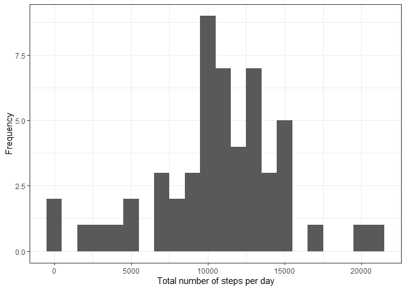
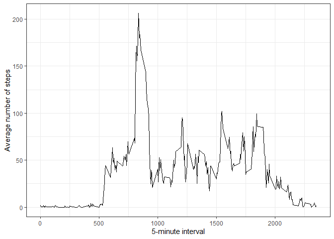
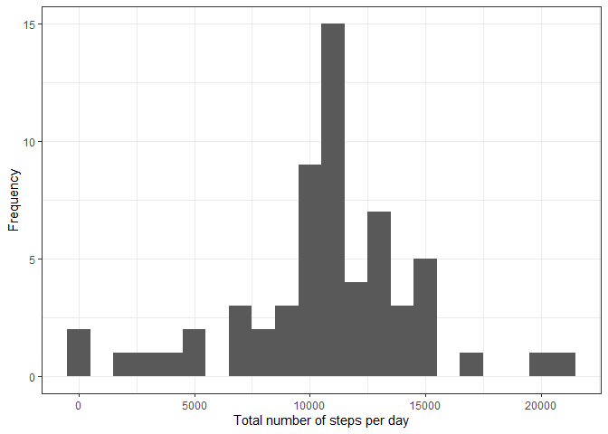
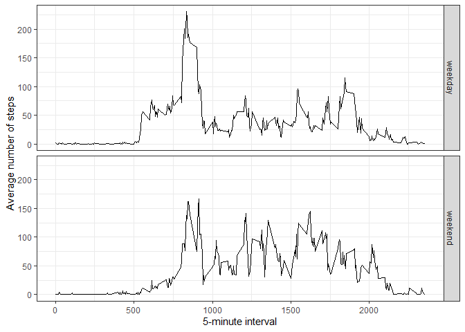
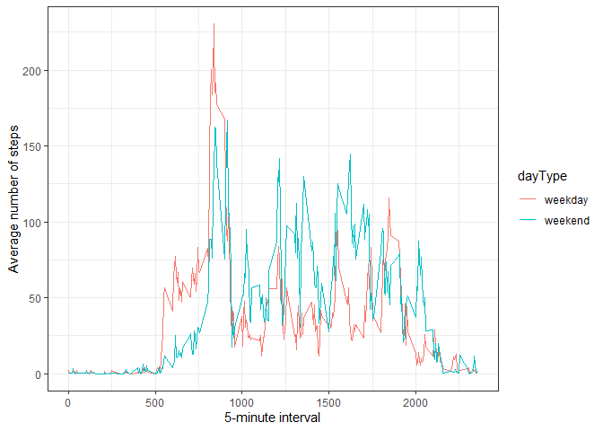

## Set the working directory


```r
setwd("C:/Users/EmelineMourocq/Documents/Giving Life to Data Project/COURS/Coursera-Data Science Specialization/Cours 5 - Reporductilbe Research/Week 2/Assignement week 2")
```

## Install the necessary packages

```r
if (!require('ggplot2')) install.packages('ggplot2'); library('ggplot2')
if (!require('plyr')) install.packages('plyr'); library('plyr')
if (!require('dplyr')) install.packages('dplyr'); library('dplyr')
if (!require('lubridate')) install.packages('lubridate'); library('lubridate')
if (!require('chron')) install.packages('chron'); library('chron')
```

### A. Loading and preprocessing the data

#### 1. Load the data (i.e. read.csv())

a. Download the data.zip file, unzip it, read and load the data


```r
temp <- tempfile()
download.file("https://d396qusza40orc.cloudfront.net/repdata%2Fdata%2Factivity.zip",temp)
data <- read.csv(unz(temp, "activity.csv"),sep=",")
unlink(temp)
```

b. Get general information on the dataset


```r
str(data)
```

```
## 'data.frame':	17568 obs. of  3 variables:
##  $ steps   : int  NA NA NA NA NA NA NA NA NA NA ...
##  $ date    : Factor w/ 61 levels "2012-10-01","2012-10-02",..: 1 1 1 1 1 1 1 1 1 1 ...
##  $ interval: int  0 5 10 15 20 25 30 35 40 45 ...
```

```r
head(data)
```

```
##   steps       date interval
## 1    NA 2012-10-01        0
## 2    NA 2012-10-01        5
## 3    NA 2012-10-01       10
## 4    NA 2012-10-01       15
## 5    NA 2012-10-01       20
## 6    NA 2012-10-01       25
```

c. Provide a summary of the dataset


```r
summary(data)
```

```
##      steps                date          interval     
##  Min.   :  0.00   2012-10-01:  288   Min.   :   0.0  
##  1st Qu.:  0.00   2012-10-02:  288   1st Qu.: 588.8  
##  Median :  0.00   2012-10-03:  288   Median :1177.5  
##  Mean   : 37.38   2012-10-04:  288   Mean   :1177.5  
##  3rd Qu.: 12.00   2012-10-05:  288   3rd Qu.:1766.2  
##  Max.   :806.00   2012-10-06:  288   Max.   :2355.0  
##  NA's   :2304     (Other)   :15840
```

#### 2. Process/transform the data (if necessary) into a format suitable for your analysis

a. Convert the date variable to a date format, assign it to a new variable and verify the changes (str)


```r
data$date_F<-ymd(as.character(data$date))
str(data)
```

```
## 'data.frame':	17568 obs. of  4 variables:
##  $ steps   : int  NA NA NA NA NA NA NA NA NA NA ...
##  $ date    : Factor w/ 61 levels "2012-10-01","2012-10-02",..: 1 1 1 1 1 1 1 1 1 1 ...
##  $ interval: int  0 5 10 15 20 25 30 35 40 45 ...
##  $ date_F  : Date, format: "2012-10-01" "2012-10-01" ...
```

b. Remove the missing values and verify the change (summary)


```r
noNAdata<-na.omit(data)
summary(noNAdata)
```

```
##      steps                date          interval          date_F          
##  Min.   :  0.00   2012-10-02:  288   Min.   :   0.0   Min.   :2012-10-02  
##  1st Qu.:  0.00   2012-10-03:  288   1st Qu.: 588.8   1st Qu.:2012-10-16  
##  Median :  0.00   2012-10-04:  288   Median :1177.5   Median :2012-10-29  
##  Mean   : 37.38   2012-10-05:  288   Mean   :1177.5   Mean   :2012-10-30  
##  3rd Qu.: 12.00   2012-10-06:  288   3rd Qu.:1766.2   3rd Qu.:2012-11-16  
##  Max.   :806.00   2012-10-07:  288   Max.   :2355.0   Max.   :2012-11-29  
##                   (Other)   :13536
```

### B. What is mean total number of steps taken per day?

#### 1. Make an histogram of the total number of steps taken each day

a. Get the total value of steps per day


```r
SpDsum<-ddply(noNAdata,.(date_F),summarize,TotSteps=sum(steps))
summary(SpDsum)
```

```
##      date_F              TotSteps    
##  Min.   :2012-10-02   Min.   :   41  
##  1st Qu.:2012-10-16   1st Qu.: 8841  
##  Median :2012-10-29   Median :10765  
##  Mean   :2012-10-30   Mean   :10766  
##  3rd Qu.:2012-11-16   3rd Qu.:13294  
##  Max.   :2012-11-29   Max.   :21194
```

b. Make the histogram


```r
ggplot(SpDsum, aes(x=TotSteps)) + geom_histogram(binwidth=1000) +
        xlab("Total number of steps per day") + ylab("Frequency") +theme_bw()
```

<!-- -->

#### 2. Calculate and report the mean and median total number of steps taken per day

a. Gives the mean


```r
mean(SpDsum$TotSteps)
```

```
## [1] 10766.19
```

b. Gives the mediane


```r
median(SpDsum$TotSteps)
```

```
## [1] 10765
```

### C. What is the average daily activity pattern?

#### 1. Make a time series plot (i.e. type = "l") of the 5-minute interval (x-axis) and the average number of steps taken, averaged across all days (y-axis)

a. Get the average value of steps per interval across all days


```r
SpImean<-ddply(noNAdata,.(interval),summarize,MeanSteps=mean(steps))
summary(SpImean)
```

```
##     interval        MeanSteps      
##  Min.   :   0.0   Min.   :  0.000  
##  1st Qu.: 588.8   1st Qu.:  2.486  
##  Median :1177.5   Median : 34.113  
##  Mean   :1177.5   Mean   : 37.383  
##  3rd Qu.:1766.2   3rd Qu.: 52.835  
##  Max.   :2355.0   Max.   :206.170
```

b. Make the time series plot


```r
ggplot(SpImean, aes(x=interval,y=MeanSteps)) + geom_line() +
        xlab("5-minute interval") + ylab("Average number of steps") +theme_bw()
```

<!-- -->

#### 2. Which 5-minute interval, on average across all the days in the dataset, contains the maximum number of steps?

Get the interval with maximum number of steps


```r
SpImean[which.max(SpImean$MeanSteps),]$interval
```

```
## [1] 835
```

### D. Imputing missing values

#### 1. Calculate and report the total number of missing values in the dataset (i.e. the total number of rows with NAs)


```r
sum(is.na(data$steps))
```

```
## [1] 2304
```

#### 2. Devise a strategy for filling in all of the missing values in the dataset. The strategy does not need to be sophisticated. For example, you could use the mean/median for that day, or the mean for that 5-minute interval, etc.

a. group by interval, replace NA steps by the mean step for this interval rounded to 2 digits, store it in the variable named noNAsteps, verify the changes (summary, head)
 

```r
dataRepNA <-data %>% 
        group_by(interval) %>%
        mutate(noNAsteps= replace(steps, is.na(steps), round(mean(steps, na.rm=TRUE),2)))
summary(dataRepNA)
```

```
##      steps                date          interval          date_F          
##  Min.   :  0.00   2012-10-01:  288   Min.   :   0.0   Min.   :2012-10-01  
##  1st Qu.:  0.00   2012-10-02:  288   1st Qu.: 588.8   1st Qu.:2012-10-16  
##  Median :  0.00   2012-10-03:  288   Median :1177.5   Median :2012-10-31  
##  Mean   : 37.38   2012-10-04:  288   Mean   :1177.5   Mean   :2012-10-31  
##  3rd Qu.: 12.00   2012-10-05:  288   3rd Qu.:1766.2   3rd Qu.:2012-11-15  
##  Max.   :806.00   2012-10-06:  288   Max.   :2355.0   Max.   :2012-11-30  
##  NA's   :2304     (Other)   :15840                                        
##    noNAsteps     
##  Min.   :  0.00  
##  1st Qu.:  0.00  
##  Median :  0.00  
##  Mean   : 37.38  
##  3rd Qu.: 27.00  
##  Max.   :806.00  
## 
```

```r
head(dataRepNA)
```

```
## # A tibble: 6 x 5
## # Groups:   interval [6]
##   steps date       interval date_F     noNAsteps
##   <int> <fct>         <int> <date>         <dbl>
## 1    NA 2012-10-01        0 2012-10-01      1.72
## 2    NA 2012-10-01        5 2012-10-01      0.34
## 3    NA 2012-10-01       10 2012-10-01      0.13
## 4    NA 2012-10-01       15 2012-10-01      0.15
## 5    NA 2012-10-01       20 2012-10-01      0.08
## 6    NA 2012-10-01       25 2012-10-01      2.09
```


#### 3. Create a new dataset that is equal to the original dataset but with the missing data filled in.


```r
dataNAfilled<-cbind(dataRepNA$noNAsteps,data[,-1])
names(dataNAfilled)[1] <- "noNAsteps"
dataNAfilled<-select(dataNAfilled,noNAsteps,date_F,interval)
str(dataNAfilled)
```

```
## 'data.frame':	17568 obs. of  3 variables:
##  $ noNAsteps: num  1.72 0.34 0.13 0.15 0.08 2.09 0.53 0.87 0 1.47 ...
##  $ date_F   : Date, format: "2012-10-01" "2012-10-01" ...
##  $ interval : int  0 5 10 15 20 25 30 35 40 45 ...
```


#### 4. Make a histogram of the total number of steps taken each day and Calculate and report the mean and median total number of steps taken per day. Do these values differ from the estimates from the first part of the assignment? What is the impact of imputing missing data on the estimates of the total daily number of steps?

a. Get the total value of steps per day


```r
noNASpDsum<-ddply(dataNAfilled,.(date_F),summarize,TotStepsnoNA=sum(noNAsteps))
summary(noNASpDsum)
```

```
##      date_F            TotStepsnoNA  
##  Min.   :2012-10-01   Min.   :   41  
##  1st Qu.:2012-10-16   1st Qu.: 9819  
##  Median :2012-10-31   Median :10766  
##  Mean   :2012-10-31   Mean   :10766  
##  3rd Qu.:2012-11-15   3rd Qu.:12811  
##  Max.   :2012-11-30   Max.   :21194
```

b. Make the histogram


```r
ggplot(noNASpDsum, aes(x=TotStepsnoNA)) + geom_histogram(binwidth=1000) +
        xlab("Total number of steps per day") + ylab("Frequency") +theme_bw()
```

<!-- -->

c. Gives the mean with and without imputation


```r
mean(noNASpDsum$TotStepsnoNA)
```

```
## [1] 10766.18
```

```r
mean(SpDsum$TotSteps)
```

```
## [1] 10766.19
```

d. Gives the mediane with and without imputation


```r
median(noNASpDsum$TotStepsnoNA)
```

```
## [1] 10766.13
```

```r
median(SpDsum$TotSteps)
```

```
## [1] 10765
```

Do these values differ from the estimates from the first part of the assignment? 

They are quite similar

What is the impact of imputing missing data on the estimates of the total daily number of steps?

The mean could be considered equal, and the median slightly smaller

### E. Are there differences in activity patterns between weekdays and weekends?

#### 1. Create a new factor variable in the dataset with two levels - "weekday" and "weekend" indicating whether a given date is a weekday or weekend day.


```r
dataNAfilled$dayType = as.factor(chron::is.weekend(dataNAfilled$date_F))
levels(dataNAfilled$dayType)<-c("weekday","weekend")
str(dataNAfilled)
```

```
## 'data.frame':	17568 obs. of  4 variables:
##  $ noNAsteps: num  1.72 0.34 0.13 0.15 0.08 2.09 0.53 0.87 0 1.47 ...
##  $ date_F   : Date, format: "2012-10-01" "2012-10-01" ...
##  $ interval : int  0 5 10 15 20 25 30 35 40 45 ...
##  $ dayType  : Factor w/ 2 levels "weekday","weekend": 1 1 1 1 1 1 1 1 1 1 ...
```


#### 2. Make a panel plot containing a time series plot (i.e. type = "l") of the 5-minute interval (x-axis) and the average number of steps taken, averaged across all weekday days or weekend days (y-axis).
 
a. Get the average value of steps per interval for weekday and weekend


```r
SpImeanDayType<-dataNAfilled %>% group_by(dayType,interval) %>% 
        summarise (MeanSteps = mean(noNAsteps))
summary(SpImeanDayType)
```

```
##     dayType       interval        MeanSteps      
##  weekday:288   Min.   :   0.0   Min.   :  0.000  
##  weekend:288   1st Qu.: 588.8   1st Qu.:  2.048  
##                Median :1177.5   Median : 28.133  
##                Mean   :1177.5   Mean   : 38.988  
##                3rd Qu.:1766.2   3rd Qu.: 61.263  
##                Max.   :2355.0   Max.   :230.378
```

b. Make the time series plot for weekday and weekend Option 1


```r
ggplot(SpImeanDayType, aes(x=interval,y=MeanSteps)) + geom_line() +
        xlab("5-minute interval") + ylab("Average number of steps") +
        facet_grid(dayType ~ .) + theme_bw()
```

<!-- -->

b. Make the time series plot for weekday and weekend Option 2


```r
ggplot(SpImeanDayType, aes(x=interval,y=MeanSteps,color=dayType)) + geom_line() +
        xlab("5-minute interval") + ylab("Average number of steps")  + theme_bw()
```

<!-- -->
